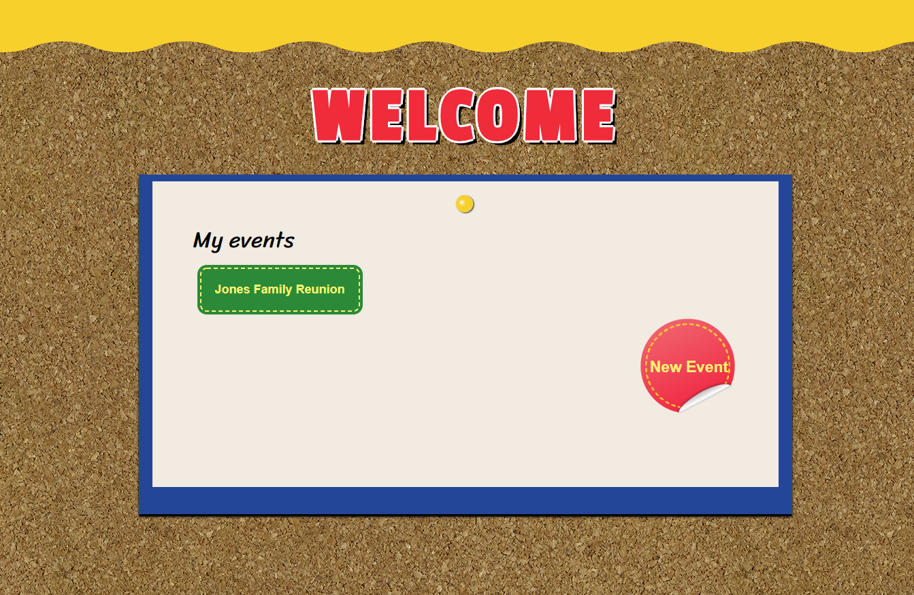
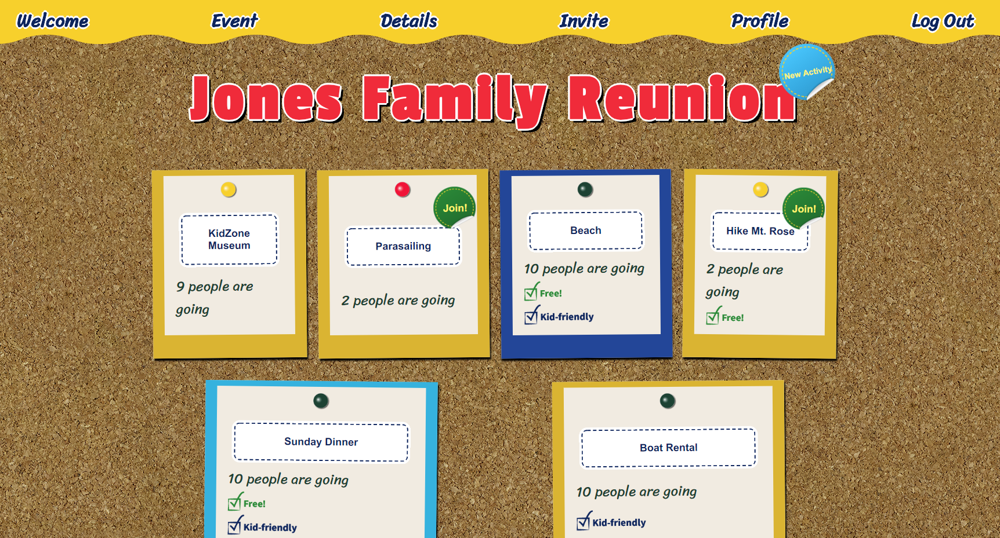
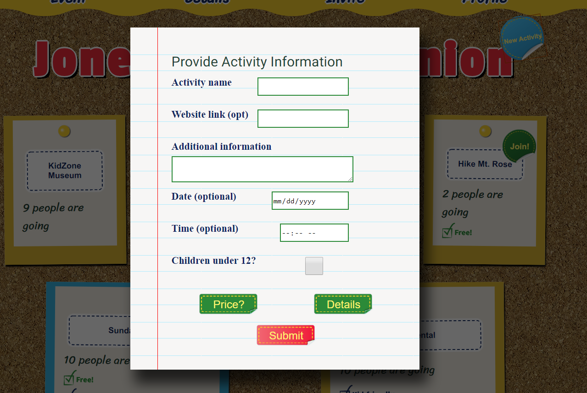
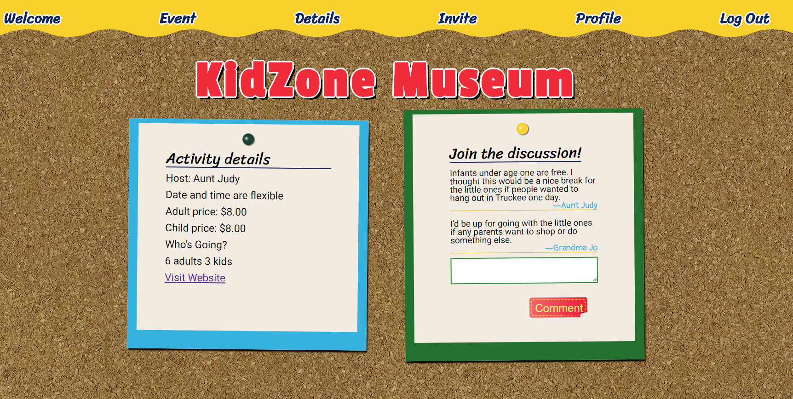
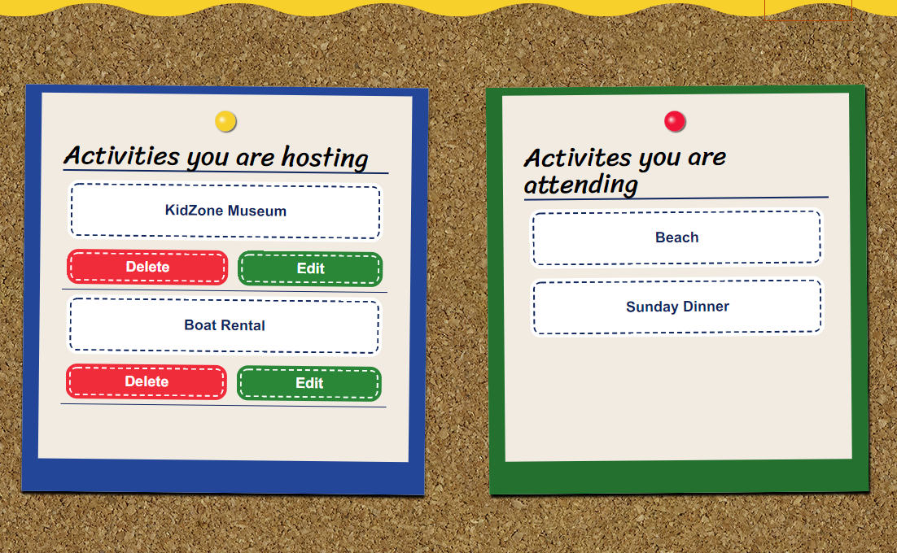

# Family Reunion

## View it Live
https://family-reunion-2018.herokuapp.com/

## Summary
I have a large family and when we all get together, it sometimes gets tricky to coordinate schedules. Not everyone wants to do the same things and sometimes there are outings that have a group rate for pricing but that wouldn't be worth it for just a few people. I created this app to make coordinating schedules easier.

Users can sign up for an account, and then have the opportunity to create an "event", such as a family reunion. They can then invite friends and/or family with a link that will allow them to be added to the event when they register. 

Event members can then create new "activities", which are the smaller outings that happen during the event. These could be things like a family meal, picnic, hike, or renting a boat together. They can add details such a cost, a link to more info or a date either when setting up the activity or later from their profile page. 

Now the fun part! Other group members can join the activity and a message board on the detail page for the activity allows members to coordinate schedules or discuss other details.

## Screenshots

Landing page:

Landing page (From invite link):

*Slightly different appearance, informing users of the event they are joining*

Welcome page:

*Users will be shown any events for which they are registered*

Event page:

Create Activity Form:

*The form is split into multiple sections. This allows the user to easier add as many or few details as is necissary.*

Activity page:

Profile page:

Invite link:

*This is the link generated to invite others to join the event*
