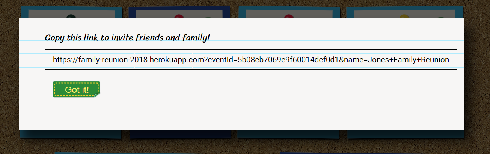

# Family Reunion

## View it Live
https://family-reunion-2018.herokuapp.com/

## Summary
I have a large family and when we all get together, it sometimes gets tricky to coordinate schedules. Not everyone wants to do the same things, some people have small children that need naps, and some are on a stricter budget. I created this app to make coordinating schedules easier.

Users can sign up for an account, and then have the opportunity to create an "event", such as a family reunion. They can then invite friends and/or family with a link that will allow them to be added to the event when they register. 

Event members can then create new "activities", which are the smaller outings that happen during the event. These could be things like a family meal, picnic, hike, or renting a boat together. They can add details such a cost, a link to more info or a date either when setting up the activity or later from their profile page. 

Now the fun part! Other group members can join the activity and a message board on the detail page for the activity allows members to coordinate schedules or discuss other details.

## Screenshots

**Landing page:**

**Landing page (From invite link):**
Slightly different appearance, informing users of the event they are joining

**Welcome page:**
Users will be shown any events for which they are registered

**Event page:**

**Create Activity Form:**
The form is split into multiple sections. This allows the user to easier add as many or few details as is necissary.

**Activity page:**

**Profile page:**

**Invite link:**
This is the link generated to invite others to join the event

## Future updates
**Near future**
* Updates for user profile. CRUD operation to change password, etc exist in the back end but have no yet been added to the front end. I would like to have that as a section on the profile page
* Removing oneself from an activity. Again, this has back-end but not front-end support

**Later on**
* One thing testers recommended was the ability to sign up as a family, with names and ages or children added to the user
* A family could separate and kids of different ages could be added to different activities without their parents necessarily being there
* This will require reconfigure the database schema so it is still far off in planning

## Learning experiences
I think the biggest thing that I learned from this project was how quickly the scope of something can grow. I originally planned to spend 2-3 weeks working on it and instead spent five. I still didn't do as much as I would have liked.

I learned a lot about how to make requests to the Mongo database. I had previously only added or retrieved information but I add to add numbers, push new data to arrays and filter by multiple parameters. One of the more complex requests was to get user activities that they were participating in but not hosting. It was fun to think about how to get that specific data.

Writing tests was also very educational, if a little tedious. I started with simple tests for basic CRUD operations but then realized that I had a few more complication endpoints. Figuring out how to test for those forced me to really think through what the function was actually doing and how to replicate that with a test

## Technologies
* **frontend:** HTML5, CSS, Javascript, jQuery
* **backend:** Node.js Express
* **testing:** Mocha/Chai
* **database:** MongoDB Mongoose
* **integration:** TravisCI